# UnisonMap Frontend Application Architecture

```mermaid
graph TD

    subgraph 5494fbae-group["**Diagram**<br>[External]"]
        subgraph 5494fbae-ExternalSystems["**External Systems**<br>[External]"]
            5494fbae-ES1["**UnisonMap Backend API**<br>Custom FastAPI application<br>https://unisonmap-fastapi.onrender.com/api"]
            5494fbae-ES2["**Operating System Location Services**<br>Native platform services<br>[External]"]
        end
        subgraph 5494fbae-Person["**Person**<br>[External]"]
            5494fbae-P1["**Map User**<br>Individual using the UnisonMap Frontend Application<br>[External]"]
        end
        subgraph 5494fbae-S1["**UnisonMap Frontend Application**<br>Flutter application for mapping and navigation<br>[External]"]
            subgraph 5494fbae-C1["**Mobile Application**<br>Primary Flutter application<br>[External]"]
                5494fbae-M_C1["**User Interface (UI)**<br>Visual elements and user interaction points<br>[External]"]
                5494fbae-M_C2["**Authentication Service**<br>lib/data/auth\_service.dart<br>[External]"]
                5494fbae-M_C3["**Routing Service**<br>lib/data/ors\_service.dart<br>[External]"]
                5494fbae-M_C4["**Location Data Service**<br>lib/data/ubicacion\_service.dart<br>[External]"]
                5494fbae-M_C5["**Geolocation Manager**<br>Abstracts interaction with device's native location services<br>[External]"]
                5494fbae-M_C6["**State Management (Provider)**<br>Manages application's global and local state<br>[External]"]
                5494fbae-M_C7["**Local Storage Manager**<br>lib/utils/storage\_helper.dart<br>[External]"]
                5494fbae-M_C8["**Network Client (Dio)**<br>Robust HTTP client for making API requests<br>[External]"]
                5494fbae-M_C9["**Data Models**<br>lib/models/<br>[External]"]
                %% Edges at this level (grouped by source)
                5494fbae-M_C1["**User Interface (UI)**<br>Visual elements and user interaction points<br>[External]"] -->|"Interacts with"| 5494fbae-M_C6["**State Management (Provider)**<br>Manages application's global and local state<br>[External]"]
                5494fbae-M_C1["**User Interface (UI)**<br>Visual elements and user interaction points<br>[External]"] -->|"Uses data from"| 5494fbae-M_C9["**Data Models**<br>lib/models/<br>[External]"]
                5494fbae-M_C2["**Authentication Service**<br>lib/data/auth\_service.dart<br>[External]"] -->|"Utilizes"| 5494fbae-M_C8["**Network Client (Dio)**<br>Robust HTTP client for making API requests<br>[External]"]
                5494fbae-M_C2["**Authentication Service**<br>lib/data/auth\_service.dart<br>[External]"] -->|"Uses"| 5494fbae-M_C7["**Local Storage Manager**<br>lib/utils/storage\_helper.dart<br>[External]"]
                5494fbae-M_C2["**Authentication Service**<br>lib/data/auth\_service.dart<br>[External]"] -->|"Provides data to"| 5494fbae-M_C6["**State Management (Provider)**<br>Manages application's global and local state<br>[External]"]
                5494fbae-M_C3["**Routing Service**<br>lib/data/ors\_service.dart<br>[External]"] -->|"Utilizes"| 5494fbae-M_C8["**Network Client (Dio)**<br>Robust HTTP client for making API requests<br>[External]"]
                5494fbae-M_C3["**Routing Service**<br>lib/data/ors\_service.dart<br>[External]"] -->|"Provides data to"| 5494fbae-M_C6["**State Management (Provider)**<br>Manages application's global and local state<br>[External]"]
                5494fbae-M_C3["**Routing Service**<br>lib/data/ors\_service.dart<br>[External]"] -->|"Provides data to (Map View)"| 5494fbae-M_C1["**User Interface (UI)**<br>Visual elements and user interaction points<br>[External]"]
                5494fbae-M_C4["**Location Data Service**<br>lib/data/ubicacion\_service.dart<br>[External]"] -->|"Utilizes"| 5494fbae-M_C8["**Network Client (Dio)**<br>Robust HTTP client for making API requests<br>[External]"]
                5494fbae-M_C4["**Location Data Service**<br>lib/data/ubicacion\_service.dart<br>[External]"] -->|"Receives location input from"| 5494fbae-M_C5["**Geolocation Manager**<br>Abstracts interaction with device's native location services<br>[External]"]
                5494fbae-M_C5["**Geolocation Manager**<br>Abstracts interaction with device's native location services<br>[External]"] -->|"Provides current location data to"| 5494fbae-M_C4["**Location Data Service**<br>lib/data/ubicacion\_service.dart<br>[External]"]
                5494fbae-M_C5["**Geolocation Manager**<br>Abstracts interaction with device's native location services<br>[External]"] -->|"Provides current location data to"| 5494fbae-M_C6["**State Management (Provider)**<br>Manages application's global and local state<br>[External]"]
                5494fbae-M_C7["**Local Storage Manager**<br>lib/utils/storage\_helper.dart<br>[External]"] -->|"Used by"| 5494fbae-M_C2["**Authentication Service**<br>lib/data/auth\_service.dart<br>[External]"]
                5494fbae-M_C8["**Network Client (Dio)**<br>Robust HTTP client for making API requests<br>[External]"] -->|"Used by"| 5494fbae-M_C2["**Authentication Service**<br>lib/data/auth\_service.dart<br>[External]"]
                5494fbae-M_C8["**Network Client (Dio)**<br>Robust HTTP client for making API requests<br>[External]"] -->|"Used by"| 5494fbae-M_C3["**Routing Service**<br>lib/data/ors\_service.dart<br>[External]"]
                5494fbae-M_C8["**Network Client (Dio)**<br>Robust HTTP client for making API requests<br>[External]"] -->|"Used by"| 5494fbae-M_C4["**Location Data Service**<br>lib/data/ubicacion\_service.dart<br>[External]"]
                5494fbae-M_C9["**Data Models**<br>lib/models/<br>[External]"] -->|"Used by"| 5494fbae-M_C2["**Authentication Service**<br>lib/data/auth\_service.dart<br>[External]"]
                5494fbae-M_C9["**Data Models**<br>lib/models/<br>[External]"] -->|"Used by"| 5494fbae-M_C3["**Routing Service**<br>lib/data/ors\_service.dart<br>[External]"]
                5494fbae-M_C9["**Data Models**<br>lib/models/<br>[External]"] -->|"Used by"| 5494fbae-M_C4["**Location Data Service**<br>lib/data/ubicacion\_service.dart<br>[External]"]
                5494fbae-M_C9["**Data Models**<br>lib/models/<br>[External]"] -->|"Used by"| 5494fbae-M_C6["**State Management (Provider)**<br>Manages application's global and local state<br>[External]"]
                5494fbae-M_C9["**Data Models**<br>lib/models/<br>[External]"] -->|"Used by"| 5494fbae-M_C1["**User Interface (UI)**<br>Visual elements and user interaction points<br>[External]"]
            end
            subgraph 5494fbae-C2["**Web Application**<br>Flutter (Dart)<br>[External]"]
                5494fbae-C2_note["**Similar components and interactions as Mobile Application**<br>[External]"]
            end
            subgraph 5494fbae-C3["**Desktop Application**<br>Flutter (Dart)<br>[External]"]
                5494fbae-C3_note["**Similar components and interactions as Mobile Application**<br>[External]"]
            end
        end
        %% Edges at this level (grouped by source)
        5494fbae-P1["**Map User**<br>Individual using the UnisonMap Frontend Application<br>[External]"] -->|"Uses"| 5494fbae-S1["**UnisonMap Frontend Application**<br>Flutter application for mapping and navigation<br>[External]"]
        5494fbae-P1["**Map User**<br>Individual using the UnisonMap Frontend Application<br>[External]"] -->|"Interacts with"| 5494fbae-C1["**Mobile Application**<br>Primary Flutter application<br>[External]"]
        5494fbae-P1["**Map User**<br>Individual using the UnisonMap Frontend Application<br>[External]"] -->|"Interacts with"| 5494fbae-C2["**Web Application**<br>Flutter (Dart)<br>[External]"]
        5494fbae-P1["**Map User**<br>Individual using the UnisonMap Frontend Application<br>[External]"] -->|"Interacts with"| 5494fbae-C3["**Desktop Application**<br>Flutter (Dart)<br>[External]"]
        5494fbae-S1["**UnisonMap Frontend Application**<br>Flutter application for mapping and navigation<br>[External]"] -->|"Communicates with"| 5494fbae-ES1["**UnisonMap Backend API**<br>Custom FastAPI application<br>https://unisonmap-fastapi.onrender.com/api"]
        5494fbae-S1["**UnisonMap Frontend Application**<br>Flutter application for mapping and navigation<br>[External]"] -->|"Obtains device location from"| 5494fbae-ES2["**Operating System Location Services**<br>Native platform services<br>[External]"]
        5494fbae-C1["**Mobile Application**<br>Primary Flutter application<br>[External]"] -->|"Communicates with"| 5494fbae-ES1["**UnisonMap Backend API**<br>Custom FastAPI application<br>https://unisonmap-fastapi.onrender.com/api"]
        5494fbae-C1["**Mobile Application**<br>Primary Flutter application<br>[External]"] -->|"Accesses"| 5494fbae-ES2["**Operating System Location Services**<br>Native platform services<br>[External]"]
        5494fbae-C2["**Web Application**<br>Flutter (Dart)<br>[External]"] -->|"Communicates with"| 5494fbae-ES1["**UnisonMap Backend API**<br>Custom FastAPI application<br>https://unisonmap-fastapi.onrender.com/api"]
        5494fbae-C2["**Web Application**<br>Flutter (Dart)<br>[External]"] -->|"Accesses"| 5494fbae-ES2["**Operating System Location Services**<br>Native platform services<br>[External]"]
        5494fbae-C3["**Desktop Application**<br>Flutter (Dart)<br>[External]"] -->|"Communicates with"| 5494fbae-ES1["**UnisonMap Backend API**<br>Custom FastAPI application<br>https://unisonmap-fastapi.onrender.com/api"]
        5494fbae-C3["**Desktop Application**<br>Flutter (Dart)<br>[External]"] -->|"Accesses"| 5494fbae-ES2["**Operating System Location Services**<br>Native platform services<br>[External]"]
        5494fbae-M_C8["**Network Client (Dio)**<br>Robust HTTP client for making API requests<br>[External]"] -->|"Makes requests to"| 5494fbae-ES1["**UnisonMap Backend API**<br>Custom FastAPI application<br>https://unisonmap-fastapi.onrender.com/api"]
        5494fbae-M_C5["**Geolocation Manager**<br>Abstracts interaction with device's native location services<br>[External]"] -->|"Interacts with"| 5494fbae-ES2["**Operating System Location Services**<br>Native platform services<br>[External]"]
    end

```




This document describes the architecture of the `unisonmap-frontend` application, a Flutter-based client for mapping and navigation functionalities. It follows the C4 model, detailing persons, systems, containers, and components, along with their relationships.

## 1. System Context Diagram (Level 1: Persons and Systems)

### Persons

-   **Map User**: An individual who uses the UnisonMap Frontend Application to access mapping, navigation, authentication, and profile management features.

### External Systems

-   **UnisonMap Backend API**: A custom-built FastAPI application (`https://unisonmap-fastapi.onrender.com/api`) that provides backend services for authentication, user management, routing calculations (via OpenRouteService), and location data storage.
-   **Operating System Location Services**: Native platform services (e.g., iOS Core Location, Android Location Services, Web Geolocation API) that provide the device's current geographical location.

### System

-   **UnisonMap Frontend Application**: The Flutter application that provides the user interface and client-side logic for UnisonMap's features.

### Relationships

-   **Map User** uses the **UnisonMap Frontend Application** to interact with mapping and navigation features.
-   **UnisonMap Frontend Application** communicates with the **UnisonMap Backend API** to:
    -   Authenticate users (login, register, fetch user details, validate tokens).
    -   Request routing data.
    -   Send/receive location-related information.
    -   Perform health checks.
-   **UnisonMap Frontend Application** obtains the device's current location from **Operating System Location Services**.

## 2. Container Diagram (Level 2: Containers within the UnisonMap Frontend Application System)

The UnisonMap Frontend Application is delivered as multiple containers, leveraging Flutter's cross-platform capabilities.

### System: UnisonMap Frontend Application

-   **Container: Mobile Application (Flutter)**
    -   **Description**: The primary Flutter application deployed on iOS and Android mobile devices.
    -   **Technology**: Flutter (Dart), `dio`, `provider`, `shared_preferences`, `flutter_map`, `geolocator`.
-   **Container: Web Application (Flutter)**
    -   **Description**: The Flutter application compiled for web browsers, accessible via a URL.
    -   **Technology**: Flutter (Dart), `dio`, `provider`, `shared_preferences`, `flutter_map`, `geolocator`.
-   **Container: Desktop Application (Flutter)**
    -   **Description**: The Flutter application compiled for desktop operating systems (Linux, macOS, Windows).
    -   **Technology**: Flutter (Dart), `dio`, `provider`, `shared_preferences`, `flutter_map`, `geolocator`.

### Relationships

-   **Map User** interacts directly with the **Mobile Application**, **Web Application**, or **Desktop Application**.
-   All three application containers (`Mobile`, `Web`, `Desktop`) communicate with the **UnisonMap Backend API** and access **Operating System Location Services**.

## 3. Component Diagram (Level 3: Components within the Mobile Application Container)

This section details the key components within the **Mobile Application** container. The **Web Application** and **Desktop Application** containers generally contain a similar set of components and internal interactions.

### Container: Mobile Application (Flutter)

-   **Component: User Interface (UI)**
    -   **Description**: Comprises all visual elements and user interaction points. Includes screens for authentication, dashboard, map display, navigation, user profiles, and reusable widgets.
    -   **Technology**: Flutter Widgets, Material Design.
    -   **Relationships**:
        -   Interacts with **State Management** to display data and trigger actions.
        -   Uses data from **Data Models**.
-   **Component: Authentication Service** (`lib/data/auth_service.dart`)
    -   **Description**: Handles all user authentication flows (login, registration, token management, user session validation).
    -   **Technology**: Dart, `dio`.
    -   **Relationships**:
        -   Communicates with the **UnisonMap Backend API** (`/auth/login`, `/usuarios/register`, `/auth/me`).
        -   Utilizes **Network Client** for HTTP requests.
        -   Uses **Local Storage Manager** to persist tokens.
        -   Provides data to **State Management**.
-   **Component: Routing Service** (`lib/data/ors_service.dart`)
    -   **Description**: Manages requests for route calculations and retrieves routing data.
    -   **Technology**: Dart, `dio`.
    -   **Relationships**:
        -   Communicates with the **UnisonMap Backend API** (`/rutas/ors/{desdeId}/{haciaId}`).
        -   Utilizes **Network Client** for HTTP requests.
        -   Provides data to **State Management** and **UI (Map View)**.
-   **Component: Location Data Service** (`lib/data/ubicacion_service.dart`)
    -   **Description**: Handles sending and receiving user location data to/from the backend.
    -   **Technology**: Dart, `dio`.
    -   **Relationships**:
        -   Communicates with the **UnisonMap Backend API** (`/ubicaciones`).
        -   Utilizes **Network Client** for HTTP requests.
        -   Receives location input from **Geolocation Manager**.
-   **Component: Geolocation Manager**
    -   **Description**: Abstracts interaction with device's native location services to obtain the current geographical position.
    -   **Technology**: `geolocator` package.
    -   **Relationships**:
        -   Interacts with **Operating System Location Services**.
        -   Provides current location data to **Location Data Service** and **State Management**.
-   **Component: State Management (Provider)**
    -   **Description**: Manages the application's global and local state using the Provider package, ensuring data consistency and reactivity across UI components.
    -   **Technology**: `provider` package.
    -   **Relationships**:
        -   Receives data updates from **Authentication Service**, **Routing Service**, **Location Data Service**, and **Geolocation Manager**.
        -   Provides data to the **UI** components.
-   **Component: Local Storage Manager** (`lib/utils/storage_helper.dart`)
    -   **Description**: Handles persistent storage of small data (e.g., user tokens, preferences) on the device.
    -   **Technology**: `shared_preferences` package.
    -   **Relationships**:
        -   Used by **Authentication Service** to store/retrieve tokens.
-   **Component: Network Client (Dio)**
    -   **Description**: A robust HTTP client for making API requests, configured with interceptors (e.g., `token_interceptor.dart`) for common concerns like adding authorization headers.
    -   **Technology**: `dio` package.
    -   **Relationships**:
        -   Used by **Authentication Service**, **Routing Service**, and **Location Data Service** to perform network requests to the **UnisonMap Backend API**.
-   **Component: Data Models** (`lib/models/`)
    -   **Description**: Defines the data structures (Dart classes) used throughout the application, often mapping to API responses or local state objects.
    -   **Technology**: Dart classes.
    -   **Relationships**:
        -   Used by all service components to parse and structure API data.
        -   Used by **UI** components for data display.

### Unified View (Conceptual Nesting)

```
Person: Map User
  uses -> System: UnisonMap Frontend Application
    contains -> Container: Mobile Application (Flutter)
      contains -> Component: User Interface (UI)
        interacts with -> Component: State Management (Provider)
      contains -> Component: Authentication Service
        communicates with -> External System: UnisonMap Backend API
        uses -> Component: Network Client (Dio)
        uses -> Component: Local Storage Manager
        updates -> Component: State Management (Provider)
      contains -> Component: Routing Service
        communicates with -> External System: UnisonMap Backend API
        uses -> Component: Network Client (Dio)
        updates -> Component: State Management (Provider)
      contains -> Component: Location Data Service
        communicates with -> External System: UnisonMap Backend API
        uses -> Component: Network Client (Dio)
        receives from -> Component: Geolocation Manager
      contains -> Component: Geolocation Manager
        interacts with -> External System: Operating System Location Services
        provides to -> Component: Location Data Service
        provides to -> Component: State Management (Provider)
      contains -> Component: State Management (Provider)
        provides data to -> Component: User Interface (UI)
      contains -> Component: Local Storage Manager
        used by -> Component: Authentication Service
      contains -> Component: Network Client (Dio)
        used by -> Authentication, Routing, Location Data Services
      contains -> Component: Data Models
        used by -> all service and UI components
    contains -> Container: Web Application (Flutter)
      (Similar components as Mobile Application)
    contains -> Container: Desktop Application (Flutter)
      (Similar components as Mobile Application)
```

---
*Generated by [CodeViz.ai](https://codeviz.ai) on 9/8/2025, 6:31:39 PM*
